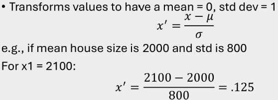

### Data Representation (Attribute-Value pairs)
- Categorial Attribute
	- Definition: Converting categorical variables into a binary format to ensure categorical data can be effectively used in ML models 
	- Technique: One-hot Encoding (Except Decision Trees)
	- Importance: 
		- Compatibility with ML algorithms.
		- Eliminating ordinality. There is no natural or inherent ordering, only equality testing is meaningful
		- Improving model performance.
	- Challenge: Synonymy is a major challenge, be careful and consistent on labelling.

- Ordinal Attribute
	- Definition: Data with a natural ordering
	- Technique: Encoded as numbers to preserve ordering.
	- Note: Meaningful to compare numbers (<, >, =), but not to add, multiply, mearure distance.

- Numerical Attribute
	- Definition: Integers or real numbers, meaningful to add, multiply, compute mean/variance.
	- Note: 
		- Perform normalization before modelling (0-mean and 1-variance)
		- Sensitive to outliers, handle it before normalization

### Data Preparation
- Dealing with missing data, three types in below:
	- Missing completely at random
	- Missing at random
	- Not missing at random
- Detecting outliers (Unusually large or small numbers)

### Feature Engineering
The process of creating, selecting, and transforming features to improve model performance.
- Feature Extraction
	- The process of projecting the original high-dimensional features to a new FEATURE SPACE with lower dimensionality.
	- In order to reduce the dimension of the DATA SPACE, eliminating redundancy among the original features.
- Feature Selection
	- Directly selects a subset of relevant features.
	- In order to reduce the dimension of the FEATURE SPACE.
- Feature Scaling
	- Puts all features on a comparable scale, improving training efficiency and stability.
	- Techniques:
		- Min-Max Normalization
		
		- Standardization
		