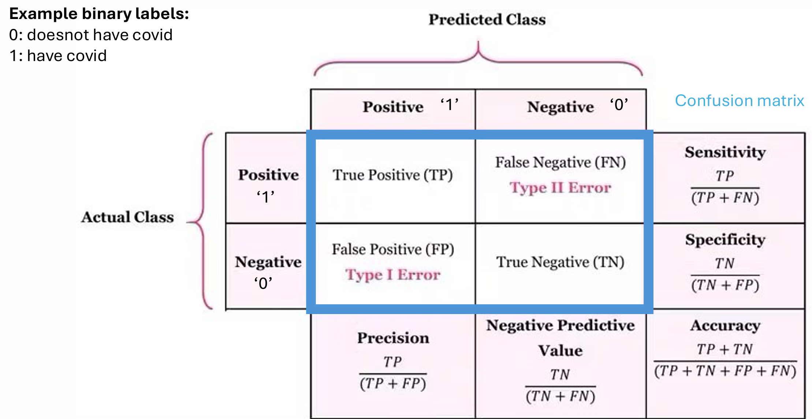

- Confusion Matrix 
- Accuracy
- Precision
- Recall / Sensitive (True possitive rate)
    - How many of the positive predictions made by the model are actually correct
- F1 Score
    - Harmonic mean of precision and recall

- Receiver Operating Characteristic Curves 
(ROC Curves)
    - A graph used to check how well a binary classification model works
    - Area Under Curve (AUC)
Summarizes the ROC Curve into a single number
        - Close to top-left corner --> AUC is near 1.
        - A diagonal from (0,0) to (1,1) --> AUC is 0.5, random guessing
        - Below the diagonal --> AUC < 0.5